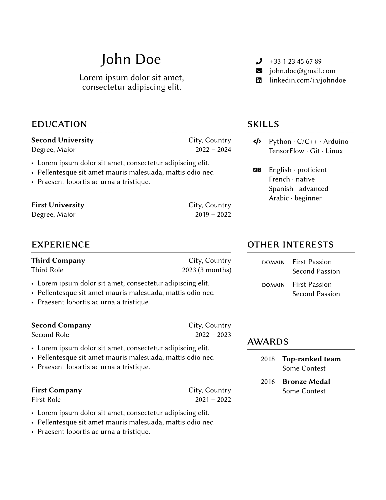

# Libre CV
A sleek and minimalist two-column resume template. Freely inspired by [Freeman CV](https://www.latextemplates.com/template/freeman-cv).

## Usage
All you need is to copy the content of `resume.tex` to an [Overleaf](https://www.overleaf.com) project, for instance.

